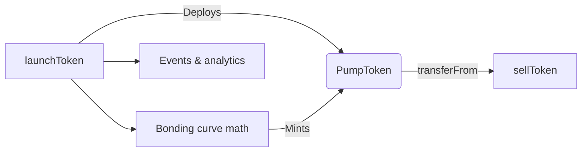

# 💊 NadFun Monad Smart Contracts

[](LICENSE)
[](https://docs.soliditylang.org/)
[](https://hardhat.org/)

> A professional-grade port of the viral Nad.fun experience to Monad’s
> EVM-compatible ecosystem. Launch tokens, price them via a bonding curve, and
> prepare for Uniswap liquidity in one workflow.

## Table of contents

- [Features](#features)
- [Architecture](#architecture)
- [Project layout](#project-layout)
- [Getting started](#getting-started)
- [Available scripts](#available-scripts)
- [Testing & quality gates](#testing--quality-gates)
- [Deployment guide](#deployment-guide)
- [Roadmap & ideas](#roadmap--ideas)
- [Contact](#contact)

## Features

- **Instant token factories** – deploy ERC20 pump tokens with one transaction
  and optional ETH bootstrap.
- **Linear bonding curve** – rewards early supporters via predictable pricing
  math (`_calculateReserveAfterBuy` / sell counterpart).
- **Protocol fees** – configurable basis-point fees accrue to the owner and can
  be swept via `claimFee`.
- **Liquidity migration ready** – stores Uniswap router + WETH handles so pools
  can be seeded automatically once thresholds are hit.
- **Typed Hardhat toolchain** – TypeScript-based tests, Ignition module, and a
  deployment script for repeatable releases.

## Architecture

See the full write-up in `docs/architecture.md`. The short version:



- `PumpCloneFactory` deploys `PumpToken`s, keeps per-token reserve metadata, and
  emits lifecycle events.
- `PumpToken` is a minimal ERC20 where only the factory can mint beyond the
  initial 1 token.
- Admins can tune reserves and withdraw accumulated fees without touching the
  bonding-curve state machine for live tokens.

## Project layout

```
contracts/                Solidity sources (factory, token, interfaces, mocks)
ignition/modules/         Hardhat Ignition deployment recipe
scripts/deploy.ts         CLI deployment entry point
test/                     TypeScript unit tests + helpers
docs/                     Architecture & deployment references
```

## Getting started

```bash
git clone https://github.com/earthskyorg/nad.fun-smart-contract.git
cd nad.fun-smart-contract
yarn install
cp env.example .env  # fill PRIVATE_KEY + router + RPCs
yarn build
```

Optional: enable the gas reporter by toggling `ENABLE_GAS_REPORT=true` in the
`.env`.

## Available scripts

| Command            | Description                                             |
| ------------------ | ------------------------------------------------------- |
| `yarn build`       | Compile contracts with optimizer settings enabled       |
| `yarn test`        | Run the Hardhat test suite once                         |
| `yarn test:watch`  | Watch + rerun tests when sources change                 |
| `yarn coverage`    | Produce solidity-coverage reports                       |
| `yarn lint`        | Run `solhint` + TypeScript type-checking                |
| `yarn format`      | Format Solidity + TS via Prettier                       |
| `yarn deploy:*`    | Deploy using `scripts/deploy.ts` (testnet / mainnet)    |

## Testing & quality gates


- Tests build deterministic fixtures, assert math helpers, and cover admin
  code paths.
- `solhint` and Prettier enforce consistent formatting for Solidity + TypeScript
  files.
- Gas reporting is available by toggling the environment flag.

## Deployment guide

The detailed playbook lives in `docs/deployment.md`. Quick summary:

1. Configure `.env` with your private key, RPC URLs, and router address.
2. `yarn clean && yarn build`
3. `yarn deploy:testnet` or `yarn deploy:mainnet`
4. Update downstream consumers with the deployed factory address and verify via
   Sourcify/Etherscan equivalents.

## Roadmap & ideas

- Integrate automatic Uniswap pool seeding once a liquidity threshold is met.
- Plug analytics dashboards directly into the emitted events stream.
- Explore permit-style approvals to simplify primary-market UX.

## Contact

- Telegram: [Tech Genie](https://t.me/opensea712)
- Security inbox: `security@earthsky.org`
- Contributions welcome – read `CONTRIBUTING.md` before opening a PR.
