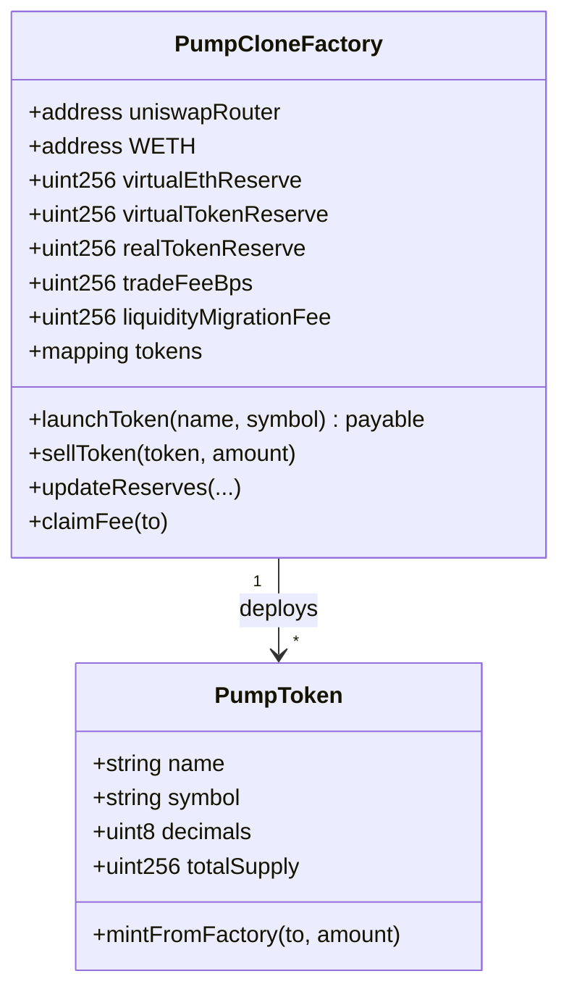

# Architecture Overview

The Nad.fun Monad deployment mirrors the original Solana experience while
remaining native to EVM tooling. The stack centres on a single factory contract
(`PumpCloneFactory`) that can mint and manage multiple bonding-curve tokens on
Monad.

## High-level components

- **PumpCloneFactory** – deploys new pump tokens, tracks bonding-curve state,
  accrues protocol fees, and exposes admin controls.
- **PumpToken** – minimal ERC20 implementation deployed by the factory for each
  launch. Only the factory can mint additional supply.
- **Routers & WETH** – external contracts referenced during the future
  liquidity-migration phase. A mock implementation is available for local tests.
- **Ignition module** – declarative deployment recipe for Hardhat Ignition.
- **Hardhat scripts** – TypeScript utilities for scripted deployments and
  verifications.

## Contract data model

## Lifecycle

1. **Launch** – a user calls `launchToken` with metadata (and optionally ETH).
   The factory deploys a `PumpToken`, seeds reserves, and executes the first buy.
2. **Trading on the curve** – subsequent buys/sells re-balance the virtual and
   real reserves, collect protocol fees, and emit analytics events.
3. **Liquidity migration (roadmap)** – once a token clears the threshold, the
   stored router + WETH addresses can be used to seed a Uniswap pool.
4. **Protocol fee claims** – operators call `claimFee` to sweep accumulated fees.

## Testing and safety

- Deterministic fixtures cover deployments, reserve math, fee accrual, and admin
  functions.
- `solhint` enforces Solidity linting, while `prettier` ensures consistent
  formatting across Solidity and TypeScript files.
- `hardhat-gas-reporter` can be toggled on via `.env` to track execution costs.

